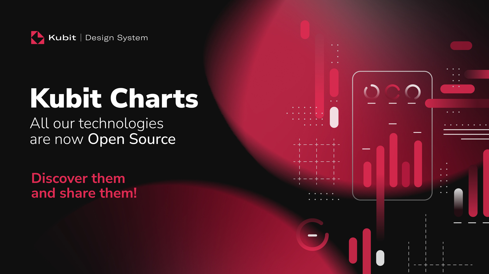

# Kubit Charts

[](https://kubit-lab.com/)
[](https://central.sonatype.com/artifact/com.kubit-lab/charts)
[]([https://kubit-lab.com/](https://kotlinlang.org/))
[]([(https://developer.android.com/compose))

[](https://play.google.com/store/apps/details?id=com.kubit.charts.storybook.app)

## ✨ Overview

Kubit Charts is a modern, accessible chart library for Android applications built with Jetpack Compose. Designed with accessibility as a core principle, it follows WCAG (Web Content Accessibility Guidelines) standards to ensure inclusive design for all users.

> 💡 **Cross-platform**: Kubit Charts is also available for [Web](https://github.com/kubit-ui/kubit-react-charts) and [iOS](https://github.com/kubit-ui/kubit-ios-charts) platforms, enabling consistent chart experiences across all your applications.

## 🚀 Quick Start

### Library Installation
[](https://central.sonatype.com/artifact/com.kubit-lab/charts)

Add the core library to your project:

```gradle
implementation("com.kubit-lab:charts:$lastVersion")
```

### Samples Installation

Optionally, add the samples package for examples and demos:

```gradle
implementation("com.kubit-lab:charts-samples:$lastVersion")
```


### Quick Example

Here's a simple LineChart to get you started:

```kotlin
@Preview
@Composable
fun SimpleLineChart() {
    val points = listOf(
        Offset(0f, 10f),
        Offset(1f, 20f),
        Offset(2f, 15f),
        Offset(3f, 30f),
        Offset(4f, 25f)
    )

    LineChart(
        modifier = Modifier.height(200.dp),
        lines = listOf(
            lineBuilder {
                addPoints(points) { index ->
                    IntersectionPoint(
                        color = Color(0xFF9C27B0),
                        radius = 4.dp
                    )
                }
                setLineStyle(
                    LineStyle(
                        lineType = LineType.SmoothCurve(dashed = false),
                        color = Color(0xFFDA0347),
                        width = 3f
                    )
                )
            }
        ).toImmutableList()
    )
}
```

## ✨ Features

| Chart Type | Key Features | Status |
|------------|--------------|--------|
| 📈 **Line Charts** | Multiple lines, shadows, animations | ✅ |
| 📊 **Bar Charts** | Horizontal, stacked, grouped | ✅ |
| 🥧 **Pie Charts** | Custom labels, borders, rotation | ✅ |
| 🎯 **Plot Charts** | Interactive points, custom markers | ✅ |
| 🎚️ **Axis Components** | Multiple orientations, styling | ✅ |
| 🔍 **Zoom Area** | Pinch-to-zoom, pan gestures | ✅ |
| 🏷️ **Legend** | Positioning, custom styling | ✅ |
| 📱 **Chart Scaffold** | Scroll, zoom, responsive layout | ✅ |

## 🔄 Development Status

This library is currently in `experimental version` and under active development. More charts, features, and improvements are continuously being added.

### 🛣️ Roadmap

| Feature | Description                                  | Status |
|---------|----------------------------------------------|--------|
| 📊 **Enhanced Storybook** | Improved UI/UX with better samples and documentation | 🚧 In Progress |
| 🌐 **Kotlin Multiplatform** | Full KMP support for iOS, Web, and Desktop   | 📅 Planned |
| 📈 **New Chart Types** | Radar, Funnel, Heatmap charts...             | 📅 Planned |
| 🎨 **Animations** | Smooth transitions and animated data updates | 📅 Planned |

## 📱 Live Demo

Explore all chart types in our interactive Storybook app:

| Basic Examples | Interactive Features | Chart Variety | Advanced Styling |
|----------------|---------------------|---------------|------------------|
|  |  |  |  |

## ♿ Accessibility First

Built with inclusivity in mind:

- ✅ **WCAG 2.1 AA Compliant** - Meets accessibility standards
- 🔊 **Screen Reader Support** - Full TalkBack compatibility
- ⌨️ **Keyboard Navigation** - Complete keyboard accessibility
- 🎯 **Focus Management** - Proper focus indicators and tab order
- 🏷️ **Semantic Labels** - Meaningful content descriptions
- 📝 **Alternative Text** - Comprehensive alt text for visual data
- 🎨 **High Contrast** - Adapts to system accessibility settings

## 📚 Documentation

For comprehensive guides, examples, and detailed API documentation:

👉 **[Complete Documentation](README_EXTENDED_DOC.md)**


## 🙏 Acknowledgments

We extend our heartfelt gratitude to all the developers and contributors who have made Kubit Charts possible. Your dedication, feedback, and contributions continue to drive innovation and make this library better for the entire community. Thank you for being part of the Kubit ecosystem!

---

*Built with ❤️ using Jetpack Compose*

