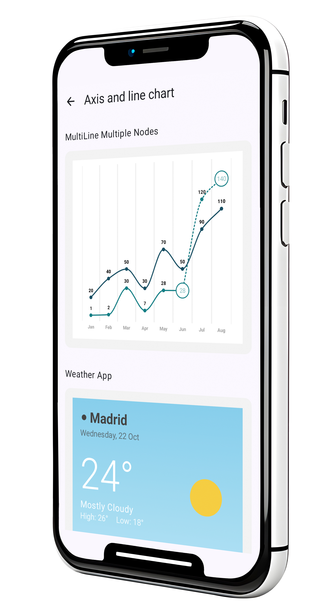
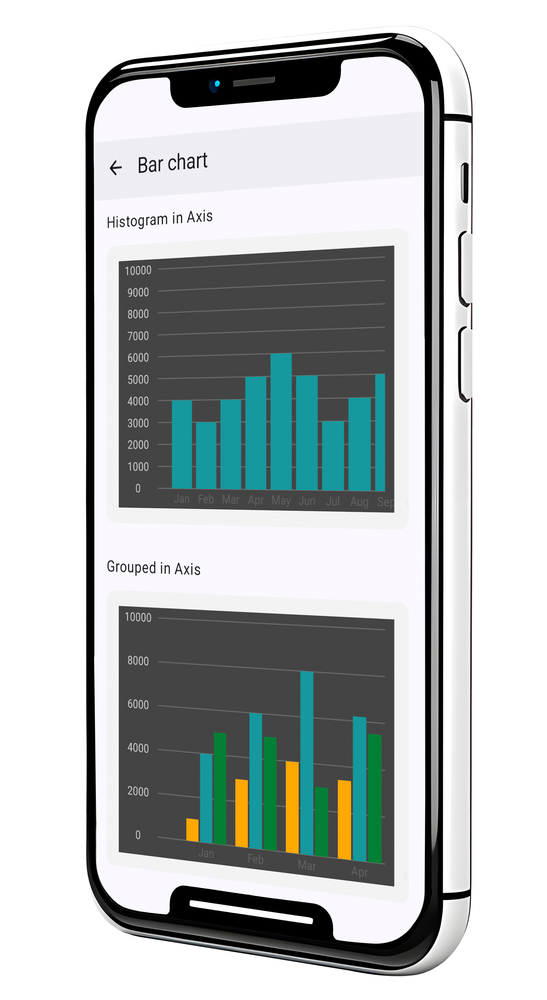
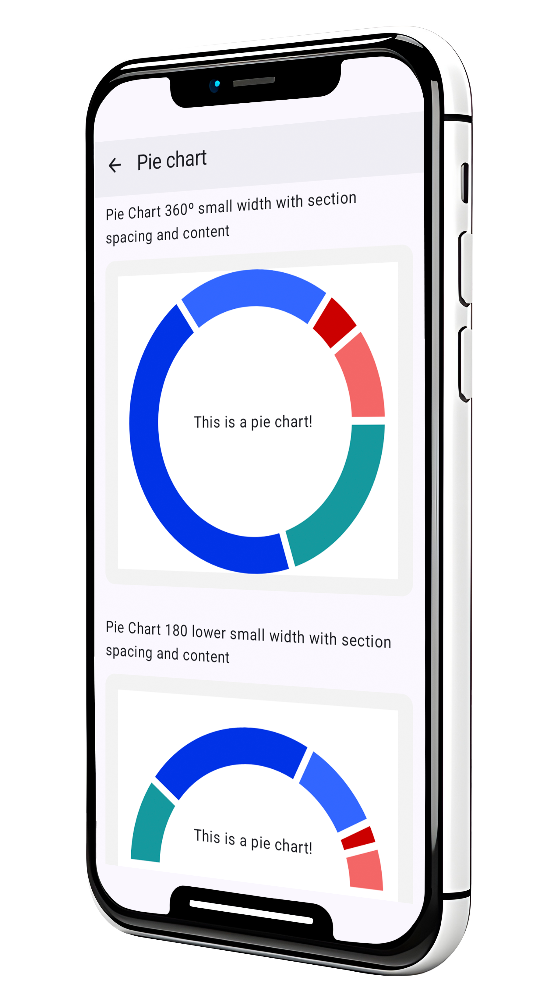
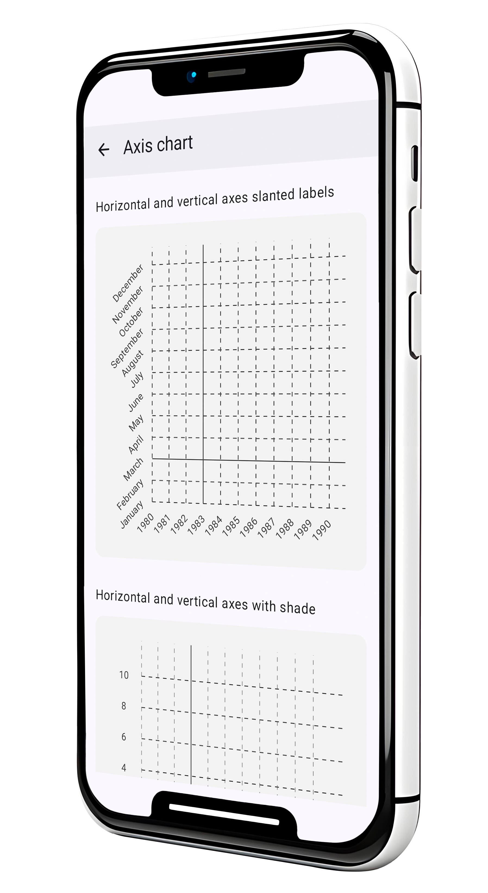

# Kubit Charts

[](https://kubit-lab.com/)
[](https://central.sonatype.com/artifact/com.kubit-lab/charts)
[]([https://kubit-lab.com/](https://kotlinlang.org/))
[]([(https://developer.android.com/compose))

[](https://central.sonatype.com/artifact/com.kubit-lab/charts)

## ✨ Overview

Kubit Charts is a modern, accessible chart library for Android applications built with Jetpack Compose. Designed with accessibility as a core principle, it follows WCAG (Web Content Accessibility Guidelines) standards to ensure inclusive design for all users.

> 💡 **Cross-platform**: Kubit Charts is also available for [Web](https://kubit-lab.com/) and [iOS](https://kubit-lab.com/) platforms, enabling consistent chart experiences across all your applications.

## 🚀 Quick Start

### Installation

Add these dependencies to your project:

```gradle
// Library
implementation("com.kubit-lab:charts:$lastVersion")

// Samples (optional)
implementation("com.kubit-lab:charts-samples:$lastVersion")
```

## 📊 Chart Types

| Chart Type | Status |
|------------|---|
| 📈 **Line Charts** | ✅ |
| 📊 **Bar Charts** | ✅ |
| 🥧 **Pie Charts** | ✅ |
| 🎯 **Plot Charts** | ✅ |
| 🎚️ **Axis Components** | ✅ |
| 🔍 **Zoom Area** | ✅ |
| 🏷️ **Legend** | ✅ |
| 📱 **Chart Scaffold** | ✅ |

## 📱 Live Demo

Explore all chart types in our interactive Storybook app:

| Basic Examples | Interactive Features | Chart Variety | Advanced Styling |
|----------------|---------------------|---------------|------------------|
|  |  |  |  |
| Core chart implementations | Zoom & scroll interactions | Line, bar & pie charts | Custom themes & styling |

## ♿ Accessibility First

Built with inclusivity in mind:

- ✅ **WCAG 2.1 AA Compliant** - Meets accessibility standards
- 🔊 **Screen Reader Support** - Full TalkBack compatibility
- ⌨️ **Keyboard Navigation** - Complete keyboard accessibility
- 🎯 **Focus Management** - Proper focus indicators and tab order
- 🏷️ **Semantic Labels** - Meaningful content descriptions
- 📝 **Alternative Text** - Comprehensive alt text for visual data
- 🎨 **High Contrast** - Adapts to system accessibility settings

## 📚 Documentation

For comprehensive guides, examples, and detailed API documentation:

👉 **[Complete Documentation](README_EXTENDED_DOC.md)**

## 🔄 Development Status

This library is currently in **alpha version** and under active development. More charts, features, and improvements are continuously being added.

---

Built with ❤️ using Jetpack Compose
