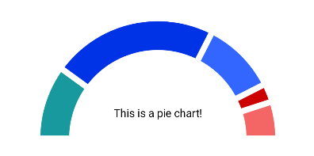

# Kubit Charts
[](https://kubit-lab.com/)
[](https://central.sonatype.com/artifact/com.kubit-lab/charts)
[]([https://kubit-lab.com/](https://kotlinlang.org/))
[]([(https://developer.android.com/compose))


Kubit Charts is a library that provides a set of customizable and easy-to-use charts for Android applications.
It is built using Jetpack Compose and currently supports:

- Axis
- Line chart
- Bar chart
- Plot chart
- Pie chart
- Zoom area chart
- Chart legend
- Chart scaffold with scroll and zoom support

This library is an alpha version and is still under development. More charts and features will be added in future releases.

### Important

For more information, examples and detailed information about different type of supported charts, check [Kubit Charts doc summary](README_EXTENDED_DOC.md)

## Installation

Add these dependencies to your project

```
//Library
implementation("com.kubit-lab:charts:$lastVersion")

//Samples
implementation("com.kubit-lab:charts-samples:$lastVersion")
```

## Storybook
Check the storybook app to see the different charts on an emulator or a real device


## Gallery

### Chart scaffold


### Axes


### Line Chart


### Pie Chart




### Bar Chart


### Plot Chart


### Zoom Area Chart

