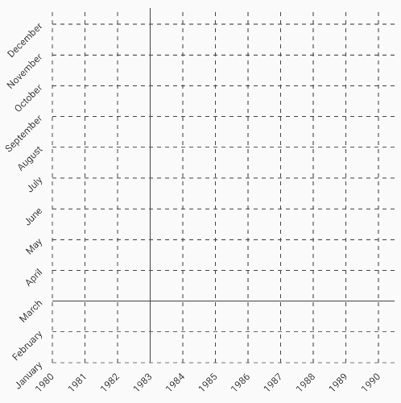
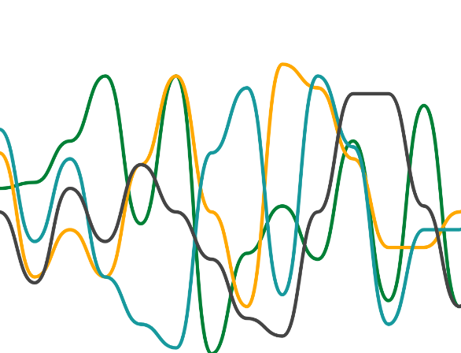
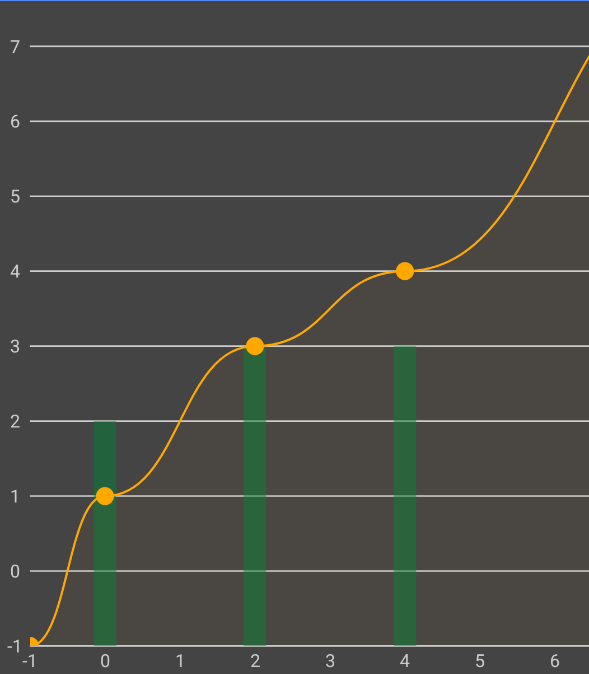
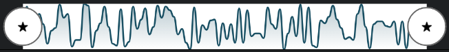

# Kubit Charts

Kubit Charts is a library that provides a set of customizable and easy-to-use charts for Android applications. 
It is built using Jetpack Compose and currently supports:

- Axis
- Line chart
- Bar chart
- Plot chart
- Pie chart
- Zoom area chart

This library is an alpha version and is still under development. More charts and features will be added in future releases.

# AxisChart Documentation

This module provides composable components for drawing horizontal and vertical axes in charts using Jetpack Compose. 
It is designed for flexibility and customization, supporting a wide range of chart axis scenarios.



## Components

### Key concepts (AxisData and AxisStep)

**AxisData**: Contains a list of `AxisStep` objects, each representing a point on the axis with a value and label. These points are in 'math' units, or 'chart' units.
In other words, they are represented in the coordinate system of the data we want to represent in a chart, not in pixels, dps or any other graphical unit.

```kotlin
val axisData = AxisData(
    axisSteps = listOf(
        AxisStep(0f, "0"),
        AxisStep(1f, "1"),
        AxisStep(2f, "2"),
        AxisStep(3f, "3"),
        AxisStep(4f, "4"),
        AxisStep(5f, "5"),
        AxisStep(6f, "6"),
        AxisStep(7f, "7"),
        AxisStep(8f, "8"),
        AxisStep(9f, "9"),
        AxisStep(10f, "10"),
    )
)
```

Inside AxisData there are two helper methods: **toCanvasCoordinatesVAxis** and **toCanvasCoordinatesHAxis**. Both methods are really similar and they are used to convert 
the 'math' units to 'canvas' units, or 'pixel' units to be able to draw them on the screen.

### `toCanvasCoordinatesVAxis` Parameters

- `height`: *(Float)* The total height of the axis in pixels. Ignored if fixedUnitSize is set.
- `topPaddingInPx`: *(Float)* Padding at the top of the axis in pixels.
- `bottomPaddingInPx`: *(Float)* Padding at the bottom of the axis in pixels.
- `decorativeHeightInPx`: *(Float)* Extra height for decorative grid lines at the axis edge, in pixels.
- `decorativeHeightPosition`: *(DecorativeHeightPosition)* Specifies where the decorative height is applied (`Top`, `Bottom`, or `Both`).
- `fixedUnitSize`: *(Float?)* If set, fixes the pixel size for each axis unit. If `null`, it is calculated automatically using height parameter.
- `zoom`: *(Float)* Zoom factor to scale the axis. Default is `1f`.

---

### `toCanvasCoordinatesHAxis` Parameters

- `width`: *(Float)* The total width of the axis in pixels. Ignored if fixedUnitSize is set.
- `startPaddingInPx`: *(Float)* Padding at the start (left) of the axis in pixels.
- `endPaddingInPx`: *(Float)* Padding at the end (right) of the axis in pixels.
- `decorativeWidthInPx`: *(Float)* Extra width for decorative grid lines at the axis edge, in pixels.
- `decorativeWidthPosition`: *(DecorativeWidthPosition)* Specifies where the decorative width is applied (`Start`, `End`, or `Both`).
- `fixedUnitSize`: *(Float?)* If set, fixes the pixel size for each axis unit. If `null`, it is calculated automatically using width parameter.
- `zoom`: *(Float)* Zoom factor to scale the axis. Default is `1f`.

In `AxisStep` you can customize the text label style and the line drawn using textStyle and stepStyle parameters respectively.

### AxisBuilder

To make it easier to create an axis, we have created a helper class: `AxisBuilder`.  With this class you can set default values for when no value is set for styles. Check these examples:

An axis with all lines dashed (except for the origin) and with default text style for all labels.
```kotlin
val sampleHorizontalAxis = AxisBuilder()
    .setDefaultLabelStyle(AxisLabelStyleDefaults.default)
    .setDefaultStepStyle(AxisStepStyleDefaults.dashed)
    .addNode(-6f, "-6")
    .addNode(-4f, "-4")
    .addNode(-2f, "-2")
    .addNode(0f, "0", style = AxisStepStyleDefaults.solid)
    .addNode(2f, "2")
    .addNode(4f, "4")
    .addNode(6f, "6")
    .addNode(8f, "8")
    .addNode(10f, "10")
    .addNode(12f, "12")
    .addNode(14f, "14")
    .build()
```

An axis with default label style, no lines except for steps 0(solid) and 10(dashed)
```kotlin
val sampleHorizontalAxisMiddleNoLabels = AxisBuilder()
    .setDefaultLabelStyle(AxisLabelStyleDefaults.default)
    .setDefaultStepStyle(null)
    .addNode(0f, "H0", style = AxisStepStyleDefaults.solid)
    .addNodes(listOf(1f, 2f, 3f, 4f, 5f, 6f, 7f, 8f, 9f))
    .addNode(10f, "HN", style = AxisStepStyleDefaults.dashed)
    .build()
```

### HorizontalAxisChart

Draws a horizontal axis with labels, grid lines, and decorative options.


**Parameters:**
- `data`: `AxisData` containing axis steps and labels.
- `labelHeight`: Height reserved for axis labels (`Dp`).
- `modifier`: Optional Compose `Modifier`.
- `type`: Axis position (`HorizontalAxisType.Top` or `HorizontalAxisType.Bottom`).
- `padding`: Custom axis padding (`AxisPadding`).
- `decorativeWidth`: Extra grid line length at the axis edge (`Dp`).
- `decorativeWidthPosition`: Position for decorative width (`DecorativeWidthPosition`).
- `customYOffset`: Custom Y offset for axis placement (`Dp?`).
- `labelVerticalAlignment`: Vertical alignment for labels (`AxisLabelVerticalAlignment`).
- `labelCenterAlignment`: Pivot for label rotation (`AxisLabelCenterAlignment`).
- `labelRotation`: Label rotation in degrees (`Float`).
- `labelVerticalGap`: Gap between labels and grid lines (`Dp`).
- `fixedUnitSize`: Fixed unit size for axis steps (`Dp?`).
- `horizontalScroll`: Horizontal scroll offset (`Dp`).
- `zoom`: Zoom factor (`Float`).
- `labelsBackgroundColor`: Background color for labels (`Color`).

**Basic Example:**
```kotlin
HorizontalAxisChart(
    data = axisData,
    labelHeight = 32.dp
)
```

**Advanced Example:**
```kotlin
HorizontalAxisChart(
    data = axisData,
    labelHeight = 32.dp,
    type = HorizontalAxisType.Bottom,
    padding = AxisPadding(start = 8.dp, end = 8.dp),
    decorativeWidth = 12.dp,
    decorativeWidthPosition = DecorativeWidthPosition.End,
    customYOffset = null,
    labelVerticalAlignment = AxisLabelVerticalAlignment.Center,
    labelCenterAlignment = AxisLabelCenterAlignment.Center,
    labelRotation = 45f,
    labelVerticalGap = 4.dp,
    fixedUnitSize = 40.dp,
    horizontalScroll = 20.dp,
    zoom = 1.2f,
    labelsBackgroundColor = Color.LightGray
)
```

### VerticalAxisChart

Draws a vertical axis with labels, grid lines, and decorative options.


**Parameters:**
- `data`: `AxisData` containing axis steps and labels.
- `labelWidth`: Width reserved for axis labels (`Dp`).
- `modifier`: Optional Compose `Modifier`.
- `type`: Axis position (`VerticalAxisType.Start` or `VerticalAxisType.End`).
- `padding`: Custom axis padding (`AxisPadding`).
- `decorativeHeight`: Extra grid line length at the axis edge (`Dp`).
- `decorativeHeightPosition`: Position for decorative height (`DecorativeHeightPosition`).
- `customXOffset`: Custom X offset for axis placement (`Dp?`).
- `labelHorizontalAlignment`: Horizontal alignment for labels (`AxisLabelHorizontalAlignment`).
- `labelCenterAlignment`: Pivot for label rotation (`AxisLabelCenterAlignment`).
- `labelRotation`: Label rotation in degrees (`Float`).
- `labelHorizontalGap`: Gap between labels and grid lines (`Dp`).
- `fixedUnitSize`: Fixed unit size for axis steps (`Dp?`).
- `verticalScroll`: Vertical scroll offset (`Dp`).
- `zoom`: Zoom factor (`Float`).
- `labelsBackgroundColor`: Background color for labels (`Color`).

**Basic Example:**
```kotlin
VerticalAxisChart(
    data = axisData,
    labelWidth = 48.dp
)
```

**Advanced Example:**
```kotlin
VerticalAxisChart(
    data = axisData,
    labelWidth = 48.dp,
    type = VerticalAxisType.Start,
    padding = AxisPadding(top = 8.dp, bottom = 8.dp),
    decorativeHeight = 10.dp,
    decorativeHeightPosition = DecorativeHeightPosition.Top,
    customXOffset = 16.dp,
    labelHorizontalAlignment = AxisLabelHorizontalAlignment.Center,
    labelCenterAlignment = AxisLabelCenterAlignment.Center,
    labelRotation = 90f,
    labelHorizontalGap = 6.dp,
    fixedUnitSize = 30.dp,
    verticalScroll = 10.dp,
    zoom = 0.8f,
    labelsBackgroundColor = Color.White
)
```

## State Hoisting

You can use the hoisted state functions for advanced scenarios, such as axis dependencies or parent access to processed axis data.

**Horizontal Axis State:**
```kotlin
val chartState = rememberHorizontalAxisDataState(
    data = axisData,
    width = 400f,
    startPaddingInPx = 16f,
    endPaddingInPx = 16f,
    decorativeWidthInPx = 12f,
    decorativeWidthPosition = DecorativeWidthPosition.End,
    fixedUnitSize = 40f,
    zoom = 1f
)

HorizontalAxisChart(
    chartState = chartState,
    labelHeight = 32.dp
)
```

**Vertical Axis State:**
```kotlin
val chartState = rememberVerticalAxisDataState(
    data = axisData,
    height = 300f,
    topPaddingInPx = 8f,
    bottomPaddingInPx = 8f,
    decorativeHeightInPx = 10f,
    decorativeHeightPosition = DecorativeHeightPosition.Top,
    fixedUnitSize = 30f,
    zoom = 1f
)

VerticalAxisChart(
    chartState = chartState,
    labelWidth = 48.dp
)
```

## AxisData and AxisStep

Define your axis steps and labels using `AxisData` and `AxisStep`.

**Example:**
```kotlin
val axisData = AxisData(
    axisSteps = listOf(
        AxisStep(0f, "Zero"),
        AxisStep(10f, "Ten"),
        AxisStep(20f, "Twenty"),
        AxisStep(30f, "Thirty")
    )
)
```

## Customization

- **Alignment:** Use enums like `HorizontalAxisType`, `VerticalAxisType`, `AxisLabelHorizontalAlignment`, `AxisLabelVerticalAlignment`, and `AxisLabelCenterAlignment` for axis and label positioning.
- **Decorative Lines:** Extend grid lines with `decorativeWidth`/`decorativeHeight` and their position enums.
- **Scroll & Zoom:** Control axis scaling and scrolling with `horizontalScroll`, `verticalScroll`, and `zoom`.
- **Label Styling:** Set background color, rotation, alignment, and gaps for labels.
- **Fixed Unit Size:** Lock axis step size for precise control.

## Error Handling

If you set a non-zero scroll value without a fixed unit size, an `AxisChartException.AxisScrollWithoutFixedStepException` will be thrown.

## Shade Regions

You can define colored regions on the axis using `ShadeRegion`.

**Example:**
```kotlin
val negativeRegion = ShadeRegion(
    fromX = 0f,
    toX = 50f,
    fromY = -100f,
    toY = 0f
)
```

You can manage the shade region manually, like in this example:

```kotlin
BoxWithConstraints(modifier = modifier) {
        val width = constraints.maxWidth
        val height = constraints.maxHeight

        with(LocalDensity.current) {
            val horizontalAxisState = rememberHorizontalAxisDataState(
                data = horizontalAxisData,
                width = width.toFloat(),
                startPaddingInPx = padding.start.toPx(),
                endPaddingInPx = padding.end.toPx(),
                decorativeWidthInPx = axisDecorativeSize.toPx(),
                decorativeWidthPosition = DecorativeWidthPosition.Both
            )
            val horizontalAxisStep =
                horizontalAxisState.getAxisStepByValue(horizontalStepForVAxisOffset.axisValue)

            val verticalAxisState = rememberVerticalAxisDataState(
                data = verticalAxisData,
                height = height.toFloat(),
                topPaddingInPx = padding.top.toPx(),
                bottomPaddingInPx = padding.bottom.toPx(),
                decorativeHeightInPx = axisDecorativeSize.toPx(),
                decorativeHeightPosition = DecorativeHeightPosition.Both
            )
            val verticalAxisStep =
                verticalAxisState.getAxisStepByValue(verticalStepForHAxisOffset.axisValue)

            shadeRegion?.let {
                AxisShade(
                    fromX = horizontalAxisState.processedAxisData.toCanvasPosition(shadeRegion.fromX),
                    toX = horizontalAxisState.processedAxisData.toCanvasPosition(shadeRegion.toX),
                    fromY = verticalAxisState.processedAxisData.toCanvasPosition(shadeRegion.fromY),
                    toY = verticalAxisState.processedAxisData.toCanvasPosition(shadeRegion.toY),
                    color = KubitChartsColors.blackAlpha25,
                )
            }

            HorizontalAxisChart(
                chartState = horizontalAxisState,
                type = HorizontalAxisType.Bottom,
                labelHeight = 0.dp,
                padding = padding,
                customYOffset = verticalAxisStep?.axisValueInPx?.toDp(),
            )

            VerticalAxisChart(
                chartState = verticalAxisState,
                type = VerticalAxisType.Start,
                labelWidth = 0.dp,
                padding = padding,
                customXOffset = horizontalAxisStep?.axisValueInPx?.toDp(),
            )
        }
    }
```

Or use the helper class `ComplexAxisChart`:

```kotlin
  ComplexAxisChart(
        verticalAxisData = sampleVerticalAxis,
        horizontalAxisData = sampleHorizontalAxis,
        padding = AxisPadding(
            start = 10.dp,
            end = 10.dp,
            bottom = 10.dp,
            top = 10.dp
        ),
        axisDecorativeSize = 10.dp,
        verticalStepForHAxisOffset = sampleVerticalAxis.axisSteps[2],
        horizontalStepForVAxisOffset = sampleHorizontalAxis.axisSteps[3],
        shadeRegion = ShadeRegion(
            fromX = -6f,
            toX = 0f,
            fromY = -4f,
            toY = 0f
        )
    )
```


## Defaults

- **Label Style:** See `AxisLabelStyleDefaults.default` for default text style.
- **Grid Line Style:** Use `AxisStepStyleDefaults.solid` or `AxisStepStyleDefaults.dashed`.

## Full Example

This in an example about how to combine two axis. You can use a Box for that, but we recommend that you use `ChartScaffold` for most use cases. That component
manages scroll and zoom and it is ready to use with axes and charts.

```kotlin
val axisData = AxisData(
    axisSteps = listOf(
        AxisStep(-10f, "-10"),
        AxisStep(0f, "0"),
        AxisStep(10f, "10"),
        AxisStep(20f, "20")
    )
)

HorizontalAxisChart(
    data = axisData,
    labelHeight = 32.dp,
    type = HorizontalAxisType.Top,
    padding = AxisPadding(start = 8.dp, end = 8.dp),
    decorativeWidth = 8.dp,
    decorativeWidthPosition = DecorativeWidthPosition.Start,
    labelRotation = 30f,
    labelsBackgroundColor = Color(0xFFE0E0E0)
)

VerticalAxisChart(
    data = axisData,
    labelWidth = 48.dp,
    type = VerticalAxisType.End,
    padding = AxisPadding(top = 8.dp, bottom = 8.dp),
    decorativeHeight = 8.dp,
    decorativeHeightPosition = DecorativeHeightPosition.Bottom,
    labelRotation = 0f,
    labelsBackgroundColor = Color(0xFFF5F5F5)
)
```

# Line Chart Documentation

The `LineChart` composable displays one or more lines on a chart, supporting interactive selection, zoom, scroll, and custom styling. It is designed for use with Jetpack Compose.

`LineChart` is normally used alongside axes to be able to interpret the displayed data. There is a component which makes this task easier: `ChartScaffold` (see documentation below). 
However, you can create a custom structure or scaffold if the provided one doesn't fulfill your requirements.





## Parameters

| Name                           | Type                                      | Description                                                                                                                        |
|---------------------------------|-------------------------------------------|------------------------------------------------------------------------------------------------------------------------------------|
| `lines`                        | `ImmutableList<Line>`                     | List of lines to be drawn, each with its own data points and style.                                                                |
| `xAxisData`                    | `AxisData`                                | Data for the X-Axis, including steps and labels.                                                                                   |
| `yAxisData`                    | `AxisData`                                | Data for the Y-Axis, including steps and labels.                                                                                   |
| `xAxisStepSize`                | `Dp`                                      | Step size for the X-Axis (distance between axis points).                                                                           |
| `modifier`                     | `Modifier` (optional)                     | Modifier for the chart container.                                                                                                  |
| `yAxisStepSize`                | `Dp` (optional, defaults to `xAxisStepSize`)| Step size for the Y-Axis.                                                                                                          |
| `backgroundColor`              | `Color` (optional, default `Color.White`) | Background color of the chart.                                                                                                     |
| `layoutDirection`              | `LayoutDirection?` (optional)             | Layout direction (LTR or RTL).                                                                                                     |
| `horizontalScroll`             | `Dp` (optional, default `0.dp`)           | Horizontal scroll offset.                                                                                                          |
| `verticalScroll`               | `Dp` (optional, default `0.dp`)           | Vertical scroll offset.                                                                                                            |
| `zoom`                         | `Float` (optional, default `1f`)          | Zoom factor for scaling the chart.                                                                                                 |
| `onPointSelect`                | `((Point, Offset) -> Unit)?` (optional)   | Callback when a point is selected. Provides the data point and its canvas offset.                                                  |
| `xMin`                         | `Float?` (optional)                       | Custom minimum value for the X-Axis. If `null`, calculated from `xAxisData`.                                                       |
| `yMin`                         | `Float?` (optional)                       | Custom minimum value for the Y-Axis. If `null`, calculated from `yAxisData`.                                                       |
| `onHorizontalScrollChangeRequest` | `((Float) -> Unit)?` (optional)        | Callback for horizontal scroll requests (e.g., accessibility or keyboard).                                                         |
| `onVerticalScrollChangeRequest`   | `((Float) -> Unit)?` (optional)        | Callback for vertical scroll requests (e.g., accessibility or keyboard).                                                           |

## Features

- **Multiple Lines:** Render several lines with independent styles.
- **Interactive Selection:** Select points via touch or keyboard; callback provides data and position.
- **Zoom & Scroll:** Pan and zoom the chart for detailed inspection.
- **Custom Axis Data:** Use any axis configuration via `AxisData`.
- **Composable Intersection Nodes:** Place custom composables at intersection points.
- **Accessibility:** Supports keyboard navigation and accessibility semantics.

## Basic Usage

```kotlin
val lines = persistentListOf(
    Line(
        dataPoints = listOf(
            Point(0f, 10f),
            Point(1f, 20f),
            Point(2f, 15f)
        ),
        lineStyle = LineStyle.default
    )
)

val xAxisData = AxisData(/* ... */)
val yAxisData = AxisData(/* ... */)

LineChart(
    lines = lines,
    xAxisData = xAxisData,
    yAxisData = yAxisData,
    xAxisStepSize = 40.dp,
    yAxisStepSize = 40.dp
)
```

## Advanced Example

```kotlin
LineChart(
    lines = lines,
    xAxisData = xAxisData,
    yAxisData = yAxisData,
    xAxisStepSize = 40.dp,
    yAxisStepSize = 40.dp,
    backgroundColor = Color(0xFFF5F5F5),
    zoom = 1.5f,
    horizontalScroll = 20.dp,
    verticalScroll = 10.dp,
    onPointSelect = { point, offset ->
        // Handle point selection
    },
    xMin = 0f,
    yMin = 0f,
    onHorizontalScrollChangeRequest = { newScroll -> /* ... */ },
    onVerticalScrollChangeRequest = { newScroll -> /* ... */ }
)
```
# Data model

## Line

Represents a single line in the `LineChart`.

```kotlin
data class Line(
    val dataPoints: List<Point>,
    val lineStyle: LineStyle = LineStyle(),
    val shadowUnderLine: ShadowUnderLine? = null,
    val selectionHighlightPopUp: SelectionHighlightPopUp? = null,
    val selectionHighlightPoint: SelectionHighlightPoint? = null,
)
```

**Parameters:**
- `dataPoints`: List of `Point` objects that define the coordinates of the line.
- `lineStyle`: Visual style for the line (color, thickness, type, etc.).
- `shadowUnderLine`: Optional. Defines the area or shadow drawn under the line.
- `selectionHighlightPopUp`: Optional. Configuration for the popup shown when a point is selected.
- `selectionHighlightPoint`: Optional. Custom highlight for the selected point (what is drawn when a point is selected). If `null`, no highlight is shown.

---

## LineStyle

Defines the visual style for the path drawn in the line chart.

```kotlin
data class LineStyle(
    val lineType: LineType = LineType.SmoothCurve(isDotted = false),
    val color: Color = Color.Black,
    val width: Float = 8f,
    val alpha: Float = 1.0f,
    val style: DrawStyle = Stroke(width = width),
    val colorFilter: ColorFilter? = null,
    val blendMode: BlendMode = DrawScope.DefaultBlendMode
)
```

**Parameters:**
- `lineType`: The type of line to draw (e.g., smooth curve, straight, dotted).
- `color`: The color of the line.
- `width`: The thickness of the line in pixels.
- `alpha`: The opacity of the line (from 0.0 to 1.0).
- `style`: The drawing style, typically a `Stroke` with the specified width.
- `colorFilter`: Optional color filter to apply to the line.
- `blendMode`: The blend mode used when drawing the line.

---

## Point

Represents a single data point in a line.

```kotlin
data class Point(
    val x: Float,
    val y: Float,
    val intersectionNode: (@Composable (() -> Unit))? = null
)
```

**Parameters:**
- `x`: X-axis value.
- `y`: Y-axis value.
- `intersectionNode`: Optional. Composable to display at the intersection (e.g., a marker or icon).

---

These classes allow you to define the data and appearance of lines and points in a `LineChart`, supporting customization and interactivity.

## Intersection nodes and LineBuilder helper class

Intersection nodes are points of interest on top of a line. You can customize their appearance to show:
- Points
- Rects
- Custom shapes
- Painters
- Custom (see the section below)

You have two options to configure your intersection nodes.

Option 1: Manual line creation

```kotlin
val line = Line(
    dataPoints = listOf(
        Point(0f, 0f, intersectionNode = IntersectionPoint()),
        Point(50f, 100f, intersectionNode = IntersectionPoint()),
        Point(100f, 50f, intersectionNode = IntersectionPoint()),
    )
)
```
Option 2: Using LineBuilder

```kotlin
val line = LineBuilder().addPoints(listOf(Point(0f,0f), Point(50f,100f),Point(100f,50f))) {
    IntersectionPoint()
}
.build()
```
Using LineBuilder you can set the default intersection node to use for every node.

You can also set diferent intersection nodes depending on conditions. The example below combines composable intersection nodes with intersection points:

```kotlin
LineBuilder().addPoints(pointsData) {
    if (it % 2 == 0) {
        IntersectionPoint()
    } else {
        IntersectionComposable { modifier, point ->
            Button(
                modifier = modifier,
                onClick = {
                    Toast.makeText(
                        context,
                        "Point(${point.x},${point.y}) clicked!",
                        Toast.LENGTH_SHORT
                    ).show()
                }
            ) {
                Text(text = "Test button!", fontSize = 6.sp)
            }
        }
    }
}.build()
```

## Custom Intersection Nodes

You can display custom composables at intersection points by providing an `IntersectionComposable` in your `Point` data.

```kotlin
Point(
    x = 1f,
    y = 20f,
    intersectionNode = MyCustomIntersectionComposable()
)
```


In this example, the intersectionNodes associated with the odd points are Button composables

## Internal Logic

- **Rendering:** Uses `BoxWithConstraints` to get container size and map data points to canvas coordinates.
- **Drawing:** Draws lines, points, and area under the curve using custom draw extensions.
- **Selection:** Maintains selection state and updates on user interaction.
- **Accessibility:** Tappable and focusable areas for each point, with semantic descriptions.

## See Also

- `AxisData`, `AxisStep`
- `Line`, `LineStyle`, `LineType`
- `IntersectionComposable`

# PieChart Documentation


## Overview

`PieChart` is a highly customizable Jetpack Compose component for rendering pie charts. It supports section selection, alignment, custom styles, and central content, making it suitable for a wide range of data visualization needs.

---

## Usage Example

```kotlin
val pie = Pie(
    sections = listOf(
        PieSectionData(
            value = 40f,
            style = PieSectionStyle(Color.Red, Color.DarkRed)
        ),
        PieSectionData(
            value = 60f,
            style = PieSectionStyle(Color.Blue, Color.DarkBlue)
        )
    )
)

PieChart(
    pie = pie,
    radius = 100.dp,
    backgroundColor = Color.White
)
```

---

## Main API: PieChart

```kotlin
@Composable
fun PieChart(
    pie: Pie,
    modifier: Modifier = Modifier,
    radius: Dp = Dp.Hairline,
    verticalAlignment: PieChartVerticalAlignment = PieChartVerticalAlignment.Center,
    horizontalAlignment: PieChartHorizontalAlignment = PieChartHorizontalAlignment.Center,
    sectionWidth: Dp = Dp.Hairline,
    startAngle: Float = 0f,
    endAngle: Float = 360f,
    direction: PieChartDirection = PieChartDirection.CounterClockwise,
    backgroundColor: Color = Color.White,
    sectionsSpacing: Dp = Dp.Hairline,
    expandToFill: Boolean = false,
    contentDescription: String? = null,
    onPointSelect: ((PieSectionData, Offset) -> Unit)? = null,
    content: (@Composable () -> Unit)? = null,
)
```

### Parameters

- **pie**: Instance of `Pie` containing section data and styles.
- **modifier**: Compose modifier for layout customization.
- **radius**: Pie chart radius. If `Dp.Hairline`, uses the smaller of canvas width/height.
- **verticalAlignment**: Vertical alignment (`Center`, `Top`, `Bottom`).
- **horizontalAlignment**: Horizontal alignment (`Center`, `Left`, `Right`).
- **sectionWidth**: Section width. If `Dp.Hairline`, uses full radius.
- **startAngle**: Starting angle of the chart.
- **endAngle**: Ending angle of the chart.
- **direction**: Drawing direction (`Clockwise`, `CounterClockwise`).
- **backgroundColor**: Chart background color.
- **sectionsSpacing**: Spacing between sections.
- **expandToFill**: If `true`, chart expands to fill available space.
- **contentDescription**: Accessibility description.
- **onPointSelect**: Callback when a section is selected.
- **content**: Optional composable for center content.

---

## Related Models

### Pie

```kotlin
@Immutable
data class Pie(
    val sections: List<PieSectionData>
)
```
- **sections**: List of pie chart sections.
- **normalizeData()**: Returns a new instance with normalized (percentage) values.

---

### PieSectionData

```kotlin
@Immutable
data class PieSectionData(
    val value: Float,
    val style: PieSectionStyle,
    val label: String? = null,
    val labelAutoRotation: Boolean = false,
    val labelCustomRotation: Float = 0f,
    val content: (@Composable () -> Unit)? = null,
    val normalizedValue: Float? = null,
)
```
- **value**: Raw value of the section.
- **style**: Visual style of the section.
- **label**: Optional label text.
- **labelAutoRotation**: If true, label rotates to align with sector center.
- **labelCustomRotation**: Custom rotation angle for label.
- **content**: Optional composable inside the section.
- **normalizedValue**: Normalized (percentage) value.

---

### PieSectionStyle

```kotlin
@Immutable
data class PieSectionStyle(
    val sectorColor: Color,
    val selectedSectorColor: Color,
    val labelColor: Color = Color.White
)
```
- **sectorColor**: Section color.
- **selectedSectorColor**: Color when section is selected.
- **labelColor**: Label text color.

---

## Configuration Enums

### PieChartDirection

```kotlin
enum class PieChartDirection {
    Clockwise,
    CounterClockwise
}
```
- **Clockwise**: Draws in clockwise direction.
- **CounterClockwise**: Draws in counterclockwise direction.

---

### PieChartVerticalAlignment

```kotlin
enum class PieChartVerticalAlignment {
    Center,
    Top,
    Bottom
}
```
- **Center**: Vertically centers the chart.
- **Top**: Aligns chart to top.
- **Bottom**: Aligns chart to bottom.

---

### PieChartHorizontalAlignment

```kotlin
enum class PieChartHorizontalAlignment {
    Center,
    Left,
    Right
}
```
- **Center**: Horizontally centers the chart.
- **Left**: Aligns chart to left.
- **Right**: Aligns chart to right.

---

## Advanced Example

```kotlin
PieChart(
    pie = Pie(
        sections = listOf(
            PieSectionData(
                value = 30f,
                style = PieSectionStyle(Color.Green, Color.DarkGreen),
                label = "Green"
            ),
            PieSectionData(
                value = 70f,
                style = PieSectionStyle(Color.Yellow, Color.DarkYellow),
                label = "Yellow"
            )
        )
    ),
    radius = 120.dp,
    verticalAlignment = PieChartVerticalAlignment.Top,
    horizontalAlignment = PieChartHorizontalAlignment.Right,
    direction = PieChartDirection.Clockwise,
    backgroundColor = Color.LightGray,
    sectionsSpacing = 4.dp,
    expandToFill = true,
    contentDescription = "Sample pie chart",
    onPointSelect = { section, offset ->
        // Handle section selection
    },
    content = {
        Text("Chart Center")
    }
)
```

# BarChart Documentation

Single


Stacked


Grouped


In axes


With other charts



## Overview

`BarChart` is a Jetpack Compose component for rendering bar charts with flexible configuration. It supports single, grouped, and stacked bar charts, horizontal or vertical orientation, custom appearance, alignment, and interactive features.

---

## Main API: BarChart

```kotlin
@Composable
fun BarChart(
    data: List<BarChartData>,
    xAxisData: AxisData,
    yAxisData: AxisData,
    xAxisStepSize: Dp,
    modifier: Modifier = Modifier,
    yAxisStepSize: Dp = xAxisStepSize,
    horizontalScroll: Dp = 0.dp,
    verticalScroll: Dp = 0.dp,
    zoom: Float = 1f,
    onBarClick: (BarChartSegmentData) -> Unit = {},
)
```

### Parameters
- **data**: List of `BarChartData` objects representing each bar/group/stack.
- **xAxisData**: Data for the X axis.
- **yAxisData**: Data for the Y axis.
- **xAxisStepSize**: Step size for the X axis.
- **modifier**: Compose modifier for layout customization.
- **yAxisStepSize**: Step size for the Y axis (defaults to xAxisStepSize).
- **horizontalScroll**: Horizontal scroll offset.
- **verticalScroll**: Vertical scroll offset.
- **zoom**: Zoom factor for the chart.
- **onBarClick**: Callback invoked when a bar/segment is clicked.

---

## Related Models

### BarChartData

```kotlin
@Immutable
data class BarChartData(
    val type: BarChartType,
    val segments: List<BarChartSegmentData>,
    val appearance: BarChartAppearance = BarChartAppearance.Squared,
    val barThickness: Dp = DefaultBarThickness,
    val barSpacing: Dp = DefaultBarSpacing,
    val orientation: BarChartOrientation = BarChartOrientation.Horizontal,
    val stepPosition: Float = 0f,
    val barChartAlignment: BarChartAlignment = BarChartAlignment.Center
)
```
- **type**: Chart type (`Single`, `Stacked`, `Grouped`).
- **segments**: List of segments (bars) in the chart.
- **appearance**: Bar appearance (`Squared`, `Rounded`, `Mixed`).
- **barThickness**: Thickness of each bar.
- **barSpacing**: Spacing between bars.
- **orientation**: Chart orientation (`Horizontal`, `Vertical`).
- **stepPosition**: Position of the bar in the axis step.
- **barChartAlignment**: Alignment within the axis step (`Before`, `Center`, `After`).

---

### BarChartSegmentData

```kotlin
@Immutable
data class BarChartSegmentData(
    val maxValue: Double,
    val color: Color,
    val contentDescription: String,
    val label: String? = null,
    val minValue: Double = 0.0,
    val labelColor: Color = Color.Black,
    val labelSize: TextUnit = 14.sp,
    val labelSpacing: Dp = 8.dp,
    val labelPosition: BarChartLabelPosition? = null,
    val labelRotation: Float? = null,
)
```
- **maxValue**: Maximum value of the segment.
- **color**: Segment color.
- **contentDescription**: Accessibility description.
- **label**: Optional label text.
- **minValue**: Minimum value of the segment.
- **labelColor**: Label text color.
- **labelSize**: Label text size.
- **labelSpacing**: Spacing between label and segment.
- **labelPosition**: Label position (see below).
- **labelRotation**: Label rotation in degrees.
- **size**: Computed property (maxValue - minValue).

---

## Configuration Enums

### BarChartType
```kotlin
enum class BarChartType {
    Single,
    Stacked,
    Grouped
}
```
- **Single**: One segment per bar.
- **Stacked**: Multiple segments stacked in one bar.
- **Grouped**: Multiple bars grouped together.

### BarChartAppearance
```kotlin
enum class BarChartAppearance {
    Squared,
    Rounded,
    Mixed
}
```
- **Squared**: Square corners.
- **Rounded**: Rounded corners.
- **Mixed**: Combination of both.

### BarChartOrientation
```kotlin
enum class BarChartOrientation {
    Horizontal,
    Vertical
}
```
- **Horizontal**: Bars laid out horizontally.
- **Vertical**: Bars laid out vertically.

### BarChartLabelPosition
```kotlin
enum class BarChartLabelPosition {
    TopStart, TopEnd, BottomStart, BottomEnd, TopCenter, BottomCenter,
    Center, CenterStart, CenterEnd, CenterStartOutside, CenterEndOutside
}
```
- Positions for labels relative to the bar segment.

### BarChartAlignment
```kotlin
enum class BarChartAlignment {
    Before,
    Center,
    After
}
```
- **Before**: Aligns bar before the axis step.
- **Center**: Centers bar in the axis step.
- **After**: Aligns bar after the axis step.

---

## Usage Examples

### Basic Bar Chart
```kotlin
val data = listOf(
    BarChartData(
        type = BarChartType.Single,
        segments = listOf(
            BarChartSegmentData(
                maxValue = 100.0,
                color = Color.Blue,
                contentDescription = "Sales",
                label = "Sales"
            )
        )
    )
)
BarChart(
    data = data,
    xAxisData = xAxis,
    yAxisData = yAxis,
    xAxisStepSize = 40.dp
)
```

### Grouped Bar Chart
```kotlin
val groupedData = listOf(
    BarChartData(
        type = BarChartType.Grouped,
        segments = listOf(
            BarChartSegmentData(120.0, Color.Red, "Q1", label = "Q1"),
            BarChartSegmentData(80.0, Color.Green, "Q2", label = "Q2")
        )
    )
)
BarChart(
    data = groupedData,
    xAxisData = xAxis,
    yAxisData = yAxis,
    xAxisStepSize = 40.dp
)
```

### Stacked Bar Chart
```kotlin
val stackedData = listOf(
    BarChartData(
        type = BarChartType.Stacked,
        segments = listOf(
            BarChartSegmentData(50.0, Color.Magenta, "A", minValue = 0.0, label = "A"),
            BarChartSegmentData(100.0, Color.Cyan, "B", minValue = 50.0, label = "B")
        )
    )
)
BarChart(
    data = stackedData,
    xAxisData = xAxis,
    yAxisData = yAxis,
    xAxisStepSize = 40.dp
)
```

### Vertical Bar Chart with Custom Appearance
```kotlin
val verticalData = listOf(
    BarChartData(
        type = BarChartType.Single,
        segments = listOf(
            BarChartSegmentData(75.0, Color.Yellow, "Revenue", label = "Revenue")
        ),
        appearance = BarChartAppearance.Rounded,
        orientation = BarChartOrientation.Vertical
    )
)
BarChart(
    data = verticalData,
    xAxisData = xAxis,
    yAxisData = yAxis,
    xAxisStepSize = 40.dp
)
```

### Interactive Bar Chart
```kotlin
BarChart(
    data = data,
    xAxisData = xAxis,
    yAxisData = yAxis,
    xAxisStepSize = 40.dp,
    onBarClick = { segment ->
        println("Clicked: ${segment.label}")
    }
)
```

---

## Customization & Extension
- Customize bar appearance, orientation, alignment, and label styling.
- Use `onBarClick` for interactive charts.
- Combine different chart types for complex visualizations.

# PlotChart Documentation

## Overview


`PlotChart` is a Jetpack Compose component for rendering flexible and interactive plot charts. It supports shape-based points, custom composable points, zooming, scrolling, and background images, making it suitable for scientific, statistical, and custom visualizations.

---

## Main API: PlotChart

```kotlin
@Composable
fun PlotChart(
    data: List<PlotChartData>,
    xAxisData: AxisData,
    yAxisData: AxisData,
    xAxisStepSize: Dp,
    yaxisStepSize: Dp,
    onPlotClick: (PlotChartData) -> Unit,
    modifier: Modifier = Modifier,
    horizontalScroll: Dp = 0.dp,
    verticalScroll: Dp = 0.dp,
    zoom: Float = 1f,
    backgroundData: PlotChartBackgroundData? = null,
)
```

### Parameters
- **data**: List of plot points to display (`PlotChartData`).
- **xAxisData**: Data describing the X-axis.
- **yAxisData**: Data describing the Y-axis.
- **xAxisStepSize**: Step size for the X-axis.
- **yaxisStepSize**: Step size for the Y-axis.
- **onPlotClick**: Callback invoked when a plot point is clicked.
- **modifier**: Modifier applied to the chart container.
- **horizontalScroll**: Horizontal scroll offset (default: 0.dp).
- **verticalScroll**: Vertical scroll offset (default: 0.dp).
- **zoom**: Zoom level for the chart (default: 1f).
- **backgroundData**: Optional background data (image and dimensions).

---

## Related Models

### PlotChartData (abstract)
```kotlin
abstract class PlotChartData(
    val point: Point
)
```
- **point**: Coordinates of the point in the chart.

### PlotShapeChartData
```kotlin
@Immutable
class PlotShapeChartData(
    point: Point,
    val contentDescription: String? = null,
    val size: Dp = 24.dp,
    val shape: Shape = CircleShape,
    val color: Color = Color.Black,
) : PlotChartData(point = point)
```
- **contentDescription**: Accessibility description.
- **size**: Size of the shape.
- **shape**: Shape of the point (default: circle).
- **color**: Color of the point.

### PlotCustomChartData
```kotlin
@Immutable
class PlotCustomChartData(
    point: Point,
    val customPlot: @Composable (zoom: Float) -> Unit
) : PlotChartData(point = point)
```
- **customPlot**: Custom composable to render at the point, receives current zoom.

### PlotChartBackgroundData
```kotlin
@Immutable
data class PlotChartBackgroundData(
    val widthPoints: Pair<Float, Float>,
    val heightPoints: Pair<Float, Float>,
    val backgroundImageBitmap: ImageBitmap
)
```
- **widthPoints**: Chart width in points.
- **heightPoints**: Chart height in points.
- **backgroundImageBitmap**: Background image for the chart.

## Usage Examples

### Basic Plot Chart with Shapes
```kotlin
val points = listOf(
    PlotShapeChartData(point = Point(1f, 2f), color = Color.Red),
    PlotShapeChartData(point = Point(2f, 3f), color = Color.Blue)
)
PlotChart(
    data = points,
    xAxisData = xAxisData,
    yAxisData = yAxisData,
    xAxisStepSize = 32.dp,
    yaxisStepSize = 32.dp,
    onPlotClick = { plot -> println("Clicked: ${plot.point}") }
)
```

### Plot Chart with Custom Composables
```kotlin
val customPoints = listOf(
    PlotCustomChartData(point = Point(3f, 4f)) { zoom ->
        Icon(
            painter = painterResource(id = R.drawable.ic_star),
            contentDescription = "Star",
            modifier = Modifier.size(24.dp * zoom)
        )
    }
)
PlotChart(
    data = customPoints,
    xAxisData = xAxisData,
    yAxisData = yAxisData,
    xAxisStepSize = 32.dp,
    yaxisStepSize = 32.dp,
    onPlotClick = { plot -> /* Handle click */ }
)
```

### Plot Chart with Background Image
```kotlin
val background = PlotChartBackgroundData(
    widthPoints = 0f to 10f,
    heightPoints = 0f to 10f,
    backgroundImageBitmap = myImageBitmap
)
PlotChart(
    data = points,
    xAxisData = xAxisData,
    yAxisData = yAxisData,
    xAxisStepSize = 32.dp,
    yaxisStepSize = 32.dp,
    backgroundData = background,
    onPlotClick = { plot -> /* ... */ }
)
```

### Interactive Plot Chart
```kotlin
PlotChart(
    data = points,
    xAxisData = xAxisData,
    yAxisData = yAxisData,
    xAxisStepSize = 32.dp,
    yaxisStepSize = 32.dp,
    onPlotClick = { plot ->
        // Show details or highlight point
    }
)
```

---

## Customization & Extension
- Use `PlotShapeChartData` for simple shapes, or `PlotCustomChartData` for advanced custom visuals.
- Add a background image for context or reference.
- Handle clicks for interactive charts.
- Adjust zoom and scroll for navigation and focus.

# ZoomAreaChart Documentation




## Overview

`ZoomAreaChart` is a Jetpack Compose component for Android that provides an interactive chart area with two draggable thumbs, allowing users to select a range visually. It is designed for use cases where zooming or selecting a subset of data is required, such as financial charts, time series, or any scenario where a user needs to focus on a specific interval.

---

## Main Components

### 1. ZoomAreaChart

A composable function that renders the zoom area chart with two thumbs and a highlighted area between them.

#### Parameters
- **opacityColor**: `Color` — Color of the area between the thumbs (usually semi-transparent).
- **modifier**: `Modifier` — Modifier for the chart container.
- **backgroundColor**: `Color` — Background color of the chart.
- **thumbSize**: `Dp` — Size of the thumbs.
- **leftHandlerAccessibilityItem**: `ZoomAreaChartAccessibilityItem?` — Accessibility info for the left thumb.
- **rightHandlerAccessibilityItem**: `ZoomAreaChartAccessibilityItem?` — Accessibility info for the right thumb.
- **zoomAreaAccessibilityItem**: `ZoomAreaChartAccessibilityItem?` — Accessibility info for the zoom area.
- **content**: `@Composable () -> Unit` — Chart content.
- **startThumb**: `@Composable () -> Unit` — Custom composable for the start thumb.
- **endThumb**: `@Composable () -> Unit` — Custom composable for the end thumb.
- **onWidthChange**: `(Int) -> Unit` — Callback for chart width changes.
- **onHeightChange**: `(Int) -> Unit` — Callback for chart height changes.
- **onSelectionChange**: `(Float, Float) -> Unit` — Callback for selection range changes (values between 0f and 1f).

#### Example
```kotlin
ZoomAreaChart(
    opacityColor = Color.Blue.copy(alpha = 0.3f),
    backgroundColor = Color.White,
    thumbSize = 40.dp,
    leftHandlerAccessibilityItem = ZoomAreaChartAccessibilityItem(
        contentDescription = "Left thumb",
        leftCustomAction = "Move left",
        rightCustomAction = "Move right"
    ),
    rightHandlerAccessibilityItem = ZoomAreaChartAccessibilityItem(
        contentDescription = "Right thumb",
        leftCustomAction = "Move left",
        rightCustomAction = "Move right"
    ),
    zoomAreaAccessibilityItem = ZoomAreaChartAccessibilityItem(
        contentDescription = "Zoom area",
        leftCustomAction = "Move left",
        rightCustomAction = "Move right"
    ),
    content = { /* Chart content here */ },
    startThumb = { /* Custom composable for start thumb */ },
    endThumb = { /* Custom composable for end thumb */ },
    onWidthChange = { width -> /* Handle width change */ },
    onHeightChange = { height -> /* Handle height change */ },
    onSelectionChange = { start, end -> /* Handle selection change */ }
)
```

---

### 2. Thumb

A composable for a draggable thumb (handle) used to select the range.

#### Parameters
- **onDrag**: `(Offset) -> Unit` — Callback for drag events.
- **thumbSize**: `Dp` — Size of the thumb.
- **handlerAccessibilityItem**: `ZoomAreaChartAccessibilityItem?` — Accessibility info for the thumb.
- **content**: `@Composable () -> Unit` — Content inside the thumb.
- **modifier**: `Modifier` — Modifier for the thumb.

#### Example
```kotlin
Thumb(
    onDrag = { offset -> /* Handle drag */ },
    thumbSize = 40.dp,
    handlerAccessibilityItem = ZoomAreaChartAccessibilityItem(
        contentDescription = "Thumb",
        leftCustomAction = "Move left",
        rightCustomAction = "Move right"
    ),
    content = { /* Custom thumb UI */ }
)
```

---

### 3. ZoomArea

A composable for the draggable area between the thumbs, representing the selected range.

#### Parameters
- **startOffset**: `Offset` — Offset of the start thumb in pixels.
- **endOffset**: `Offset` — Offset of the end thumb in pixels.
- **thumbSizePx**: `Float` — Size of the thumb in pixels.
- **opacityColor**: `Color` — Color of the zoom area.
- **zoomAreaAccessibilityItem**: `ZoomAreaChartAccessibilityItem?` — Accessibility info for the zoom area.
- **onDrag**: `(Offset) -> Unit` — Callback for drag events.
- **modifier**: `Modifier` — Modifier for the zoom area.

#### Example
```kotlin
ZoomArea(
    startOffset = Offset(0f, 0f),
    endOffset = Offset(100f, 0f),
    thumbSizePx = 40f,
    opacityColor = Color.Blue.copy(alpha = 0.3f),
    zoomAreaAccessibilityItem = ZoomAreaChartAccessibilityItem(
        contentDescription = "Zoom area",
        leftCustomAction = "Move left",
        rightCustomAction = "Move right"
    ),
    onDrag = { offset -> /* Handle drag */ }
)
```

---

### 4. ZoomAreaChartAccessibilityItem

A data class for accessibility information for the chart and thumbs.

#### Properties
- **contentDescription**: `String` — Content description for accessibility.
- **leftCustomAction**: `String` — Description for the left thumb action.
- **rightCustomAction**: `String` — Description for the right thumb action.
- **movementFraction**: `Int` — Speed of movement for accessibility drag actions (default: 10).

#### Example
```kotlin
val accessibilityItem = ZoomAreaChartAccessibilityItem(
    contentDescription = "Zoom area",
    leftCustomAction = "Move left",
    rightCustomAction = "Move right",
    movementFraction = 10
)
```

---

## Accessibility

All components support accessibility via custom actions and content descriptions, making the chart usable with screen readers and other assistive technologies.

---

## Full Example

```kotlin
@Composable
fun ExampleZoomAreaChart() {
    ZoomAreaChart(
        opacityColor = Color.Green.copy(alpha = 0.2f),
        thumbSize = 32.dp,
        leftHandlerAccessibilityItem = ZoomAreaChartAccessibilityItem(
            contentDescription = "Start thumb",
            leftCustomAction = "Move start left",
            rightCustomAction = "Move start right"
        ),
        rightHandlerAccessibilityItem = ZoomAreaChartAccessibilityItem(
            contentDescription = "End thumb",
            leftCustomAction = "Move end left",
            rightCustomAction = "Move end right"
        ),
        zoomAreaAccessibilityItem = ZoomAreaChartAccessibilityItem(
            contentDescription = "Selected range",
            leftCustomAction = "Move range left",
            rightCustomAction = "Move range right"
        ),
        content = {
            // Place your chart here
        },
        startThumb = {
            Box(Modifier.size(32.dp).background(Color.Red))
        },
        endThumb = {
            Box(Modifier.size(32.dp).background(Color.Blue))
        },
        onSelectionChange = { start, end ->
            // Handle selection change
        }
    )
}
```

---

## Best Practices
- Use meaningful accessibility descriptions for all thumbs and areas.
- Customize thumb and area appearance for your app's theme.
- Handle selection changes to update your chart or data view accordingly.

# ChartScaffold Documentation

## Overview

`ChartScaffold` is a Jetpack Compose component that provides a flexible scaffold for building interactive charts with scroll and zoom support. It manages axis data, scroll orientation, pinch zoom, accessibility, and layout for custom chart content.
 It has slots for an horizontal axis, a vertical axis and a content (any type of chart)


#### Parameters

- **xAxisData**: `AxisData` — Data for the X-Axis.
- **yAxisData**: `AxisData` — Data for the Y-Axis.
- **xUnitSize**: `Dp` — Size of a unit in the X-Axis.
- **modifier**: `Modifier` — Modifier for the scaffold container.
- **axisPadding**: `AxisPadding` — Padding for the axes.
- **yUnitSize**: `Dp` — Size of a unit in the Y-Axis (default: xUnitSize).
- **scrollOrientation**: `ChartScrollOrientation` — Orientation of the scroll (default: Both).
- **isPinchZoomEnabled**: `Boolean` — Enables pinch zoom gestures (default: false).
- **accessibility**: `ScrollableAccessibilityItem?` — Accessibility configuration for a11y support.
- **horizontalAxis**: `@Composable (scroll: Dp, zoom: Float, padding: AxisPadding) -> Unit` — Composable for the horizontal axis.
- **verticalAxis**: `@Composable (scroll: Dp, zoom: Float, padding: AxisPadding) -> Unit` — Composable for the vertical axis.
- **content**: `@Composable (ChartScaffoldContentData) -> Unit` — Main chart content.

#### Example

```kotlin
ChartScaffold(
    xAxisData = xAxis,
    yAxisData = yAxis,
    xUnitSize = 32.dp,
    axisPadding = AxisPadding(),
    scrollOrientation = ChartScrollOrientation.Both,
    isPinchZoomEnabled = true,
    accessibility = ScrollableAccessibilityItem(contentDescription = "Chart"),
    horizontalAxis = { scroll, zoom, padding -> /* Draw horizontal axis */ },
    verticalAxis = { scroll, zoom, padding -> /* Draw vertical axis */ },
    content = { data -> /* Draw chart content using data */ }
)
```

---

### 2. ChartScaffoldContentData

A data class representing the current scroll and zoom state, and callbacks for scroll changes.

#### Properties

- **horizontalScroll**: `Dp` — Current horizontal scroll offset.
- **verticalScroll**: `Dp` — Current vertical scroll offset.
- **onHorizontalScrollChangeRequest**: `(Float) -> Unit` — Callback to request horizontal scroll change.
- **onVerticalScrollChangeRequest**: `(Float) -> Unit` — Callback to request vertical scroll change.
- **zoom**: `Float` — Current zoom factor.

#### Example

```kotlin
content = { data ->
    // data.horizontalScroll, data.verticalScroll, data.zoom
    // Use these values to position and scale your chart content
}
```

---

### 3. ChartScrollOrientation

Enum class to define the orientation of the scroll.

- **Horizontal**
- **Vertical**
- **Both**

#### Example

```kotlin
scrollOrientation = ChartScrollOrientation.Both
```

---

### 4. ScrollableAccessibilityItem

A data class for accessibility information for the chart scaffold.

#### Properties

- **contentDescription**: `String` — Content description for accessibility.
- **leftCustomAction**: `String?` — Description for left scroll action.
- **rightCustomAction**: `String?` — Description for right scroll action.
- **upCustomAction**: `String?` — Description for up scroll action.
- **downCustomAction**: `String?` — Description for down scroll action.
- **zoomInCustomAction**: `String?` — Description for zoom in action.
- **zoomOutCustomAction**: `String?` — Description for zoom out action.
- **scrollStepX**: `Dp` — Step size for horizontal scroll (default: 24.dp).
- **scrollStepY**: `Dp` — Step size for vertical scroll (default: 24.dp).
- **zoomStep**: `Float` — Step size for zoom (default: 0.2f).

#### Example

```kotlin
ScrollableAccessibilityItem(
    contentDescription = "Interactive chart",
    leftCustomAction = "Scroll left",
    rightCustomAction = "Scroll right",
    upCustomAction = "Scroll up",
    downCustomAction = "Scroll down",
    zoomInCustomAction = "Zoom in",
    zoomOutCustomAction = "Zoom out"
)
```

---

### 5. detectScrollGesture (Modifier Extension)

Enables drag gestures for scrolling in the specified orientation.

#### Example

```kotlin
Modifier.detectScrollGesture(
    scrollOrientation = ChartScrollOrientation.Both,
    onVerticalScroll = { /* handle vertical scroll */ },
    onHorizontalScroll = { /* handle horizontal scroll */ }
)
```

---

### 6. detectZoomGesture (PointerInputScope Extension)

Enables pinch zoom gesture detection.

#### Example

```kotlin
pointerInput(Unit) {
    detectZoomGesture(
        isZoomAllowed = true,
        onZoom = { zoomFactor -> /* handle zoom */ }
    )
}
```

---

### 7. getMaxHorizontalScrollDistance / getMaxVerticalScrollDistance

Utility functions to calculate the maximum scrollable distance based on axis data, unit size, canvas size, and padding.

---

## Full Example

```kotlin
@Composable
fun ExampleChartScaffold() {
    ChartScaffold(
        xAxisData = AxisData(...),
        yAxisData = AxisData(...),
        xUnitSize = 32.dp,
        axisPadding = AxisPadding(start = 16.dp, end = 16.dp, top = 8.dp, bottom = 8.dp),
        scrollOrientation = ChartScrollOrientation.Both,
        isPinchZoomEnabled = true,
        accessibility = ScrollableAccessibilityItem(
            contentDescription = "Financial chart",
            leftCustomAction = "Scroll left",
            rightCustomAction = "Scroll right",
            upCustomAction = "Scroll up",
            downCustomAction = "Scroll down",
            zoomInCustomAction = "Zoom in",
            zoomOutCustomAction = "Zoom out"
        ),
        horizontalAxis = { scroll, zoom, padding ->
            // Draw horizontal axis with scroll and zoom
        },
        verticalAxis = { scroll, zoom, padding ->
            // Draw vertical axis with scroll and zoom
        },
        content = { data ->
            // Draw chart content using data.horizontalScroll, data.verticalScroll, data.zoom
        }
    )
}
```

---

## Accessibility

All components support accessibility via custom actions and content descriptions, making the chart usable with screen readers and other assistive technologies.

---

## Best Practices

- Use meaningful accessibility descriptions for all actions.
- Customize axis and chart appearance for your app's theme.
- Handle scroll and zoom changes to update your chart or data view accordingly.

---


